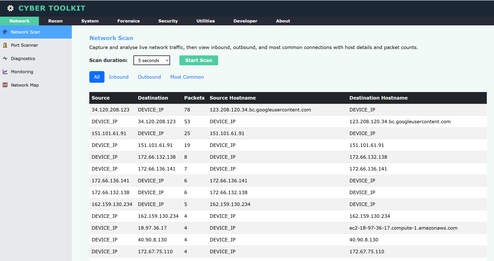
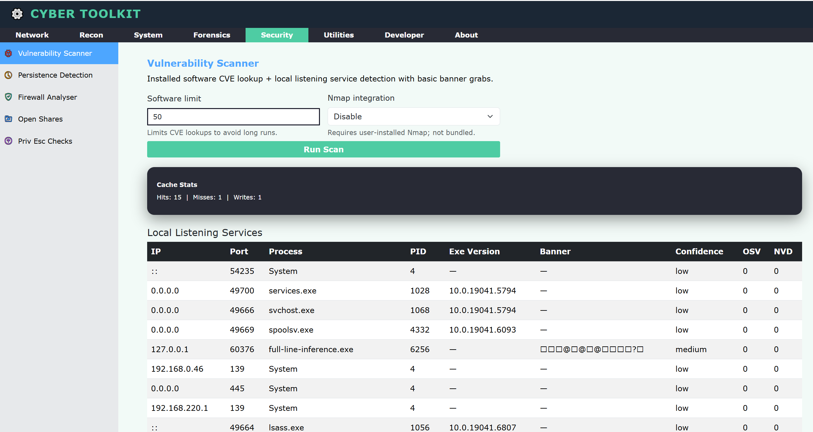
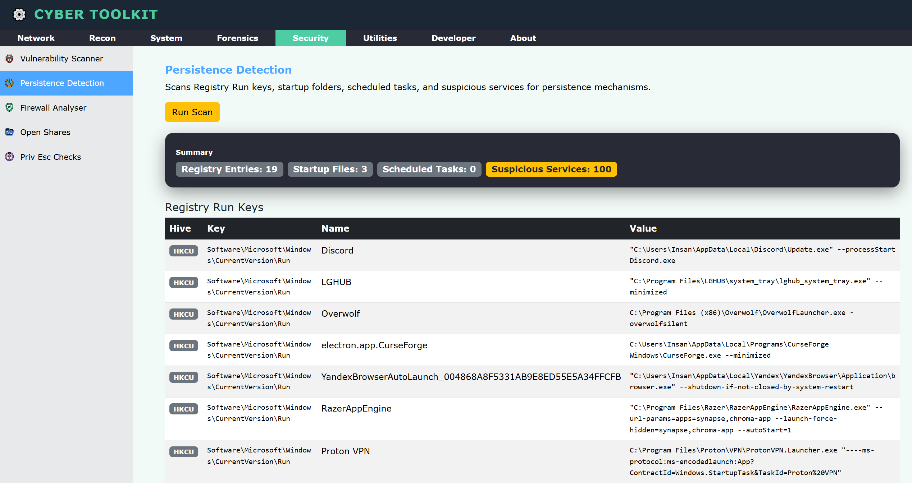
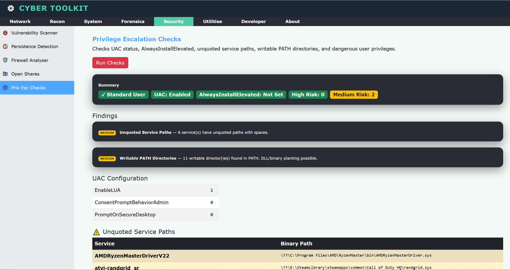
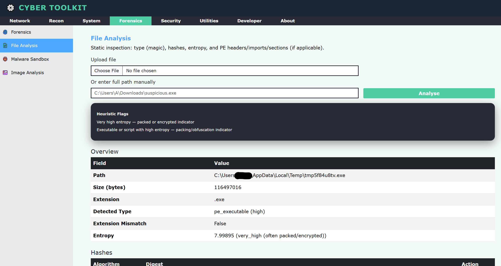
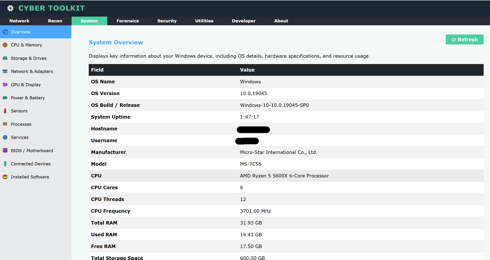
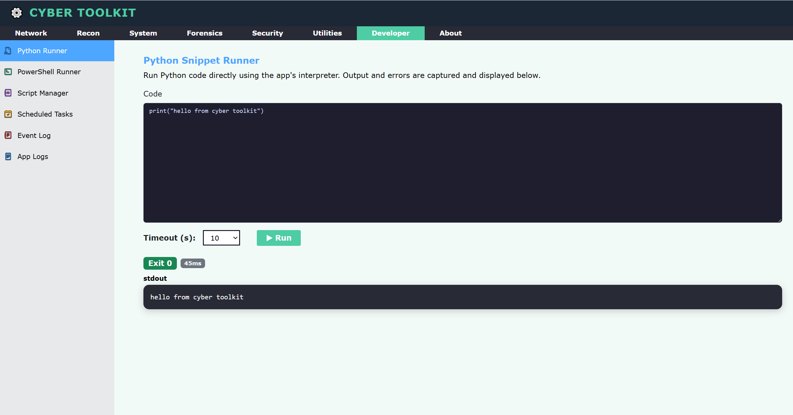
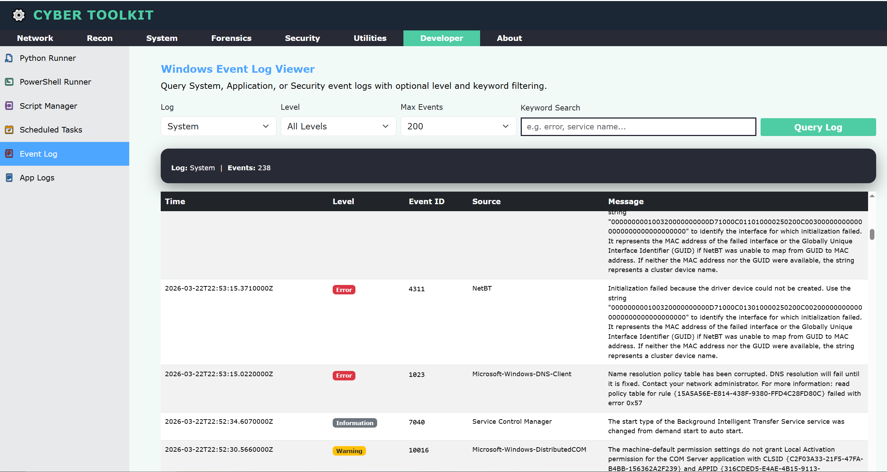

# Cyber Toolkit

A Windows-focused desktop cybersecurity utility built with Python, Flask, and pywebview. Brings together network analysis, reconnaissance, forensics, security auditing, and system inspection tools into a single offline-first desktop application with no browser required, no cloud dependency, and no data leaving your machine.

---

## Screenshots

> **Network Scan** - live packet capture with inbound/outbound/common traffic breakdown


> **Security - Vulnerability Scanner** - installed software CVE lookups via OSV and NVD


> **Security - Persistence Detection** - registry run keys, startup folders, scheduled tasks


> **Security - Privilege Escalation Checks** - UAC, unquoted paths, dangerous privileges


> **Forensics - File Analysis** - magic signature, hashes, entropy, PE header inspection


> **System - Overview** - full hardware and OS inventory


> **Developer - Python Runner** - run Python snippets with stdout/stderr capture


> **Developer - Event Log Viewer** - Windows Event Log with level and keyword filtering


---

## Features

### Network
- **Network Scan** - live packet capture via Scapy, categorised into all/inbound/outbound/common
- **Port Scanner** - multithreaded TCP port scan with service name resolution
- **Diagnostics** - ping, ARP table, interface info, DNS cache viewer
- **Monitoring** - active connections, bandwidth snapshots, top processes by network usage, interface error stats
- **Network Map** - ARP sweep and ping fallback for LAN host discovery, structured traceroute

### Recon
- DNS lookup, reverse DNS, IP geolocation, ASN lookup
- WHOIS lookup, SSL/TLS certificate inspection
- HTTP header analysis, HTTP response viewer, technology fingerprinting, robots.txt viewer
- Traceroute with structured hop output
- Infrastructure discovery: port scan, banner grab, WHOIS, certificate and geo in one run

### System
Full refreshable hardware and OS inventory including CPU, RAM, storage, network adapters, GPU, power/battery, sensors, processes, services, BIOS/motherboard, connected devices, and installed software via Windows Registry.

### Forensics
- **File System Analysis** - low-level inspection via pytsk3
- **File Analysis** - magic signature detection, MD5/SHA1/SHA256 hashing, entropy, PE header analysis
- **Malware Sandbox** - static analysis with quarantine (hashes, strings, PE sections, import table)
- **Image Analysis** - EXIF metadata extraction via exifread and Pillow

### Security
- **Vulnerability Scanner** - installed software matched against OSV and NVD CVE databases with SQLite caching and local service banner grabbing
- **Persistence Detection** - Registry Run keys, startup folders, non-Microsoft scheduled tasks, suspicious services
- **Firewall Analyser** - all Windows Firewall rules with per-profile status and inbound/outbound/block filtering
- **Open Shares Checker** - SMB share enumeration flagging exposed paths
- **Privilege Escalation Checks** - UAC config, AlwaysInstallElevated, unquoted service paths, writable PATH dirs, dangerous user privileges

### Developer / Admin
- **Python and PowerShell Snippet Runners** - isolated subprocess execution with stdout/stderr capture and timeout enforcement
- **Script Manager** - save, manage, and re-run named scripts with last output persistence
- **Scheduled Tasks Inspector** - full schtasks dump with enable/disable/run actions
- **Windows Event Log Viewer** - System/Application/Security logs with level and keyword filtering
- **App Log Viewer** - read and search app log files with colour-highlighted error/warning lines

### Utilities
- String and file hashing (MD5, SHA1, SHA-2, SHA-3, BLAKE2, CRC32)
- Base64 encode and decode
- VLSM subnet calculator

---

## Architecture
```
CyberToolkit/
├── app.py                  ← Flask routes + STATE + pywebview entry point
├── tools/
│   ├── caching_tools.py    ← JSON cache read/write helpers
│   ├── developer_tools.py  ← Snippet runners, script manager, task inspector, log viewer
│   ├── forensics_tools.py  ← File analysis, malware sandbox, image analysis
│   ├── network_tools.py    ← Packet capture, port scan, monitoring, network map
│   ├── recon_tools.py      ← DNS, WHOIS, traceroute, geo, HTTP analysis
│   ├── security_tools.py   ← Vuln scanner, persistence, firewall, privesc
│   ├── system_tools.py     ← Hardware/OS inventory via WMI + psutil
│   └── utility_tools.py    ← Hashing, encoding, subnet calculator
├── templates/              ← Jinja2 HTML templates
├── static/
│   ├── style.css
│   └── images/
├── cache/                  ← JSON result cache (auto-created)
├── logs/                   ← App log files (optional)
└── quarantine/             ← Malware sandbox quarantine directory
```

The app starts a local Flask server on `127.0.0.1:5000` and launches a native desktop window via pywebview. All tool results are stored in a central `STATE` dictionary and passed to Jinja2 templates on every render. Results are persisted to JSON cache files so previous scans survive app restarts.

---

## Requirements

- Windows 10 / 11
- Python 3.11+
- Npcap (required for Scapy packet capture) - [download here](https://npcap.com/)

### Python Dependencies
```
pip install -r requirements.txt
```
```
Flask>=3.0.0
pywebview>=4.4
psutil>=5.9.0
requests>=2.31.0
scapy>=2.5.0
pytsk3>=20230125
python-evtx>=0.7.4
python-registry>=1.3.1
pefile>=2023.2.7
exifread>=3.0.0
Pillow>=10.0.0
py-cpuinfo>=9.0.0
wmi>=1.5.1
pynvml>=11.5.0
certifi>=2023.7.22
```

---

## Installation and Running
```bash
# Clone the repository
git clone https://github.com/yourusername/cyber-toolkit.git
cd cyber-toolkit

# Install dependencies
pip install -r requirements.txt

# Run the app
python app.py

# Run without the desktop window (Flask only, useful for debugging)
python app.py --nogui
```

> **Note:** Some tools (packet capture, firewall rules, security event logs) require the app to be run as Administrator.

---

## Notes

- **Vulnerability scanner accuracy** - CVE results are based on keyword matching against OSV and NVD. False positives are expected. Always verify findings manually.
- **Malware sandbox** - static analysis only. Files are not executed. Quarantined files are stored in `quarantine/` and should be handled with care.
- **Nmap integration** - the vulnerability scanner can optionally use Nmap for richer service version detection if `nmap.exe` is installed and available in PATH or at `C:\Program Files (x86)\Nmap\nmap.exe`.
- **OSV / NVD rate limits** - the vulnerability scanner uses SQLite caching (`cache/cve_cache.sqlite`) to minimise API calls. If you hit rate limits (HTTP 429), wait a moment and re-run.

---

## Disclaimer

This tool is intended for use on systems and networks you own or have explicit written permission to test. Unauthorised use may be illegal under the Computer Misuse Act 1990 (UK), the Computer Fraud and Abuse Act (US), and equivalent legislation in other jurisdictions.

All scan results are stored locally. No telemetry or usage data is collected or transmitted.

---

## License

MIT License - see [LICENSE](LICENSE) for details.
